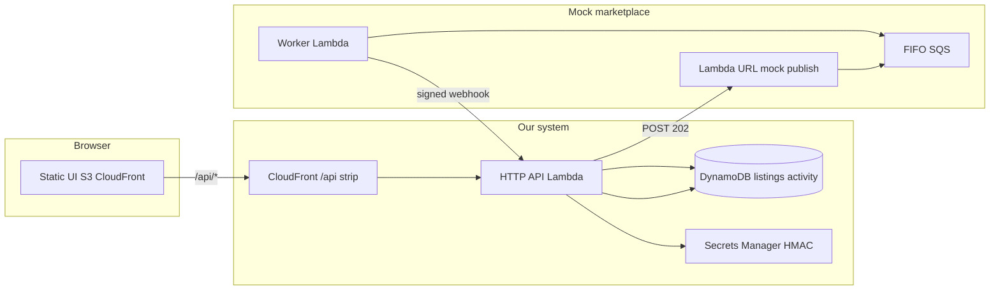

# Marketplace aggregator — approach (Variant 2)

## Approach summary

This prototype is **API-driven with an asynchronous integration boundary**: our control plane exposes a small HTTP API and DynamoDB-backed state, while a **mock third-party marketplace** owns its own ingress (Lambda function URL), internal queue (FIFO SQS), and delivery semantics. That split mirrors how we would wrap real marketplaces—HTTP + webhooks, opaque retries, and idiosyncratic failure modes—without coupling our core domain model to Lambda-only tricks. An agentic layer could sit on top later for seller support workflows, but the **durable contract** between us and partners stays request/response + signed callbacks.

## Architecture

**AWS choices (and why)**

| Service | Role |
|--------|------|
| **API Gateway HTTP API + Lambda** | Pay-per-use API; no idle cost; fine for low/moderate QPS. |
| **DynamoDB on-demand** | Two small tables (listings + activity); no provisioned capacity burn. |
| **SQS FIFO + DLQ** | Models async partner work, dedupes by `publishRequestId`, surfaces poison messages. |
| **Secrets Manager** | Webhook signing secret generated at deploy—nothing sensitive in git. |
| **S3 + CloudFront** | Cheap static hosting; `/api/*` routed to API Gateway via a tiny CloudFront Function. |
| **Lambda function URL (mock ingress)** | Clean “external” entrypoint without circular deps on our API URL. |

## Reference marketplace: eBay

**Why eBay (conceptual)**  
Mature Sell APIs, high seller volume, and a long history of rate limits and webhook-style notifications make it a good **stress template** for idempotency, retries, and signature verification—even though this build only mocks it.

**Auth model (real world)**  
OAuth 2.0 (authorization code / refresh tokens), per-developer app keys, delegated seller consent. Tokens are short-lived; refresh handling and per-seller token storage are mandatory in production.

**Rate limits**  
Sell APIs are tiered; bursts and daily caps apply per application and endpoint. A central **token bucket / scheduler** per seller+marketplace avoids 429 storms and backoff collisions.

**Webhooks / notifications**  
eBay’s notification platforms (legacy and newer schemes) deliver out-of-band events; partners must **verify signatures**, handle duplicates, and tolerate delayed delivery.

**Pitfalls**  
Category/condition taxonomy drift, mandatory item specifics, media hosting rules, partial failures on multi-step publishes, and marketplace-specific business logic (returns, managed payments) that cannot be abstracted naively behind a single DTO.

## Safety

| Topic | Prototype | Production direction |
|-------|-----------|----------------------|
| **Credentials** | Only AWS-generated webhook secret in Secrets Manager; no tokens in repo. | Per-tenant secrets (SSM/Secrets Manager); KMS CMKs; rotation. |
| **Isolation** | Single-table logical tenant (`sellerId` would be added). | Partition key includes `tenantId` / `sellerId`; IAM scoping; row-level patterns in DDB. |
| **Publish idempotency** | Client `Idempotency-Key` + GSI lookup; FIFO dedupe on `publishRequestId`. | Store partner listing id; reconcile state machine; bounded retries with jitter. |
| **Webhook verification** | HMAC-SHA256 over `timestamp.body` with 5-minute skew check. | Partner-specific schemes; replay windows; optional key rotation. |
| **Retries / DLQ** | ~15% synthetic failure in worker; SQS redrive to DLQ after 6 receives. | Alert on DLQ depth; replay tooling; idempotent event IDs (`eventId`). |
| **Abuse** | Open mock URL (prototype). | Auth on ingress (SigV4, API keys), WAF on CloudFront, request size limits. |

## Cost (rough)

Assumptions: **10 sellers, 1k listings, 10k activity events/month** (well within free tiers for many components).

- **Lambda**: sub-dollar at this volume (invocation + duration).  
- **API Gateway HTTP API**: cents to low dollars for request count.  
- **DynamoDB on-demand**: storage + request units—typically **single-digit USD** unless hot partitions.  
- **CloudFront + S3**: low traffic → **&lt; $5/month** often dominated by request minimums.  
- **Secrets Manager**: ~$0.40/secret/month + API calls (small).  
- **SQS FIFO**: cheap at this scale.

**First cost wall**  
Heavy **CloudFront + API request volume**, **DynamoDB hot partitions** (needs key design + caching), or **always-on networking** (NAT, idle ECS/EKS, provisioned Aurora). This stack avoids NAT and provisioned DB on purpose.

## What I would cut vs build next

**Cut for a hackathon**  
Custom domains, multi-region, Cognito, Step Functions choreography, full observability suite.

**Build next for a real product**  
Seller auth (Cognito/Auth.js), explicit `sellerId` on all rows, marketplace capability matrix, outbound publish state machine with per-marketplace adapters, webhook replay + signing key rotation, CloudWatch alarms (5xx, DLQ depth, Lambda throttles, API 4xx spikes), and a minimal integration test suite running in CI against a disposable stack.
